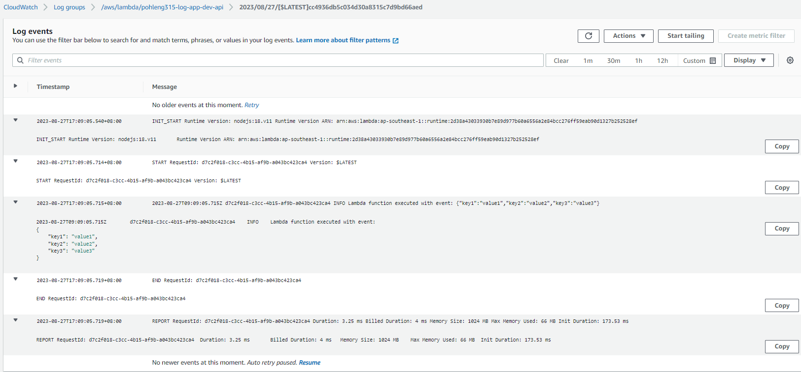

# 3.15 application logging with cloudwatch
The objective of this assignment is to set up a continuous integration and continuous deployment (CI/CD) pipeline for a Node.js application that is deployed on a serverless platform with Logging and Monitoring in placed!.

# Setting Up CI/CD Pipeline for Node.js Application with Serverless Deployment, Secret Management, and CloudWatch Logging

## Introduction

This documentation extends the previously outlined process of setting up a robust Continuous Integration and Continuous Deployment (CI/CD) pipeline for a Node.js application. In addition to automatic testing, deployment to a serverless platform, and secret management, this documentation includes the integration of CloudWatch for logging and monitoring. This comprehensive pipeline automates software delivery, enhances code quality, ensures security, and provides efficient deployment, along with comprehensive logging and monitoring capabilities.

## Tools and Services Used

1. **Node.js**: A runtime environment for server-side JavaScript.
2. **Express Framework**: A Node.js framework for building web applications and APIs.
3. **Jest**: A JavaScript testing framework.
4. **GitHub Actions**: A CI/CD platform for workflow automation.
5. **Serverless Framework**: A toolkit for deploying serverless applications.
6. **AWS Lambda**: A serverless compute service.
7. **AWS Secrets Manager**: A service for managing and securely retrieving secrets.
8. **AWS Systems Manager (SSM)**: A service for configuration management.
9. **AWS CloudWatch**: A monitoring and logging service for AWS resources.

## Steps to Enhance the CI/CD Pipeline with CloudWatch Logging

### 1. Create a New Node.js Application with Express Framework

Begin by creating a new Node.js application using the Express framework, just as before. This application will serve as the foundation for serverless deployment and CloudWatch integration.

### 2. Set Up Automatic Testing with Jest

Integrate Jest as the testing framework for the application to ensure code correctness. Automatic testing remains a fundamental part of the CI/CD pipeline.

### 3. Create a New Repository

Create a new Git repository for this enhanced CI/CD pipeline setup. We use this repository to host the new code and workflow configuration.

### 4. Set Up GitHub Actions Workflow

In the GitHub Actions workflow YAML file (`.github/workflows/main.yml`).

#### Workflow Steps (Updated):

- **Predeploy**: A placeholder step to trigger the workflow.
- **Install Dependencies**: Check out the repository code and install project dependencies using `npm ci`.
- **Unit Testing**: Execute unit tests using Jest.
- **Get Secret**: Configure AWS credentials and retrieve secrets using AWS Secrets Manager and AWS SSM, as previously described. This is assignment, we also use the new concept OIDC to test the get secret method.
- **Deploy**: Configure Node.js, install dependencies, and use the Serverless Framework GitHub Action to deploy the application to AWS Lambda.

### 5. Application Logging with CloudWatch

In the Node.js application code, integrate CloudWatch logging using the `console.log` function. This will capture relevant logs and send them to AWS CloudWatch Logs.

```javascript
module.exports.handler = async (event) => {
  // Log a message to CloudWatch Logs
  console.log('Lambda function executed with event:', JSON.stringify(event));

  return {
    statusCode: 200,
    body: JSON.stringify(
      {
        message: "Go Serverless v3.0! Your function executed successfully!",
        input: event,
      },
      null,
      2
    ),
  };
};
```

### 6. Monitor CloudWatch Logs

After deploying the application with the enhanced pipeline, we can monitor and retrieve logging information from AWS CloudWatch Logs. CloudWatch provides a comprehensive set of tools for analyzing and visualizing logs, making it easier to troubleshoot issues and gain insights into the application's behavior.



## Conclusion

By following these extended steps and leveraging the mentioned tools and services, we've set up an advanced CI/CD pipeline for your Node.js application. This pipeline now includes automated testing, secure secret management, deployment to a serverless platform, and integrated CloudWatch logging and monitoring. This comprehensive approach ensures the reliability and performance of our application while enhancing the ability to troubleshoot and optimize it.


